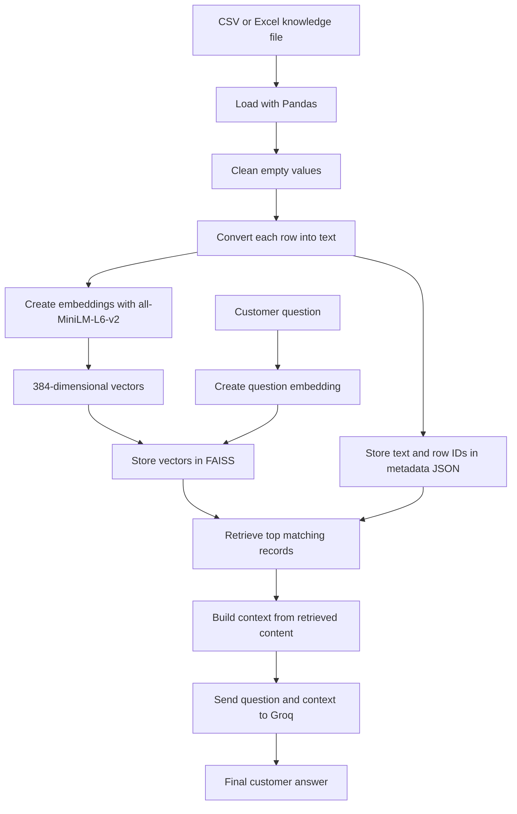

# RAG Customer Support Pipeline

## 1. Architecture Overview



## 2. Ingestion Pipeline

The ingestion pipeline prepares the business knowledge. It is run when the CSV or Excel data changes.

File: `backend/rag/excel_vector_rag.py`

Steps:

1. Read `etech_chatbot_dataset.csv` with Pandas.
2. Replace missing values with empty strings.
3. Convert each row into a text document containing the column names and values.
4. Ignore completely empty rows.
5. Send the documents to the SentenceTransformer model.
6. Create one 384-dimensional embedding for each document.
7. Normalize the embeddings.
8. Add the embeddings to a FAISS `IndexFlatIP` index.
9. Save the FAISS index as `etech_faiss.index`.
10. Save the matching row IDs and text as `etech_metadata.json`.

The FAISS vector order and metadata order must always match:

```text
FAISS vector 0  <->  metadata record 0
FAISS vector 1  <->  metadata record 1
FAISS vector 2  <->  metadata record 2
```

## 3. Question Retrieval Pipeline

The retrieval pipeline finds the most relevant business records for a customer question.

File: `backend/rag/question-vector.py`

Steps:

1. Receive a customer question.
2. Convert the question into one normalized 384-dimensional embedding.
3. Load `etech_faiss.index`.
4. Search FAISS using the question embedding.
5. Retrieve the top matching vector IDs and similarity scores.
6. Use each vector ID to find the matching text in `etech_metadata.json`.
7. Return the matching content, row ID, vector ID, and score.

## 4. Answer Generation Pipeline

Retrieval finds the source information. Groq generates the readable answer.

The answer generation stage should:

1. Receive the original customer question.
2. Receive the retrieved content from FAISS.
3. Join the retrieved content into one context block.
4. Send the question and context to Groq.
5. Tell Groq to answer only from the provided context.
6. Tell Groq not to invent prices, policies, opening hours, or warranty details.
7. Tell Groq to say when the information is unavailable.
8. Return the final answer to the customer.

Expected flow:

```text
Question + Retrieved context -> Groq -> Final answer
```

## 5. Complete Runtime Flow

```text
Customer types a question
        |
        v
Question embedding is created
        |
        v
FAISS searches the stored vectors
        |
        v
Metadata returns the matching content
        |
        v
Retrieved content becomes Groq context
        |
        v
Groq writes one clear answer
        |
        v
Frontend displays the answer
```

## 6. Files and Responsibilities

| File | Responsibility |
|---|---|
| `backend/rag/etech_chatbot_dataset.csv` | Customer-support knowledge |
| `backend/rag/excel_vector_rag.py` | Parse data, create embeddings, build FAISS index, save metadata |
| `backend/rag/etech_faiss.index` | Stored searchable vectors |
| `backend/rag/etech_metadata.json` | Text connected to each vector |
| `backend/rag/question-vector.py` | Embed questions and retrieve matching content |
| `backend/rag/rag.py` | Future Groq answer-generation or API orchestration layer |
| `frontend/` | Future customer chat interface |

## 7. Run Order

Run ingestion first whenever the data changes:

```powershell
cd backend/rag
python excel_vector_rag.py
```

Then test question retrieval:

```powershell
python question-vector.py
```

Do not rebuild the FAISS index for every customer question. Build it once after the knowledge data changes, then search it for each question.

## 8. Data Quality Rules

Before using the chatbot, replace all `[PLACEHOLDER]` values with confirmed business information.

The chatbot should not guess when:

- a price is unknown;
- a warranty period is unknown;
- a refund policy is unknown;
- a delivery or collection policy is unknown;
- a diagnosis fee is unknown.

## 9. Important Security Rule

Keep `GROQ_API_KEY` in `.env` and never place the key directly in Python code or commit it to Git. If the key has been shared publicly, revoke it and create a new one.
