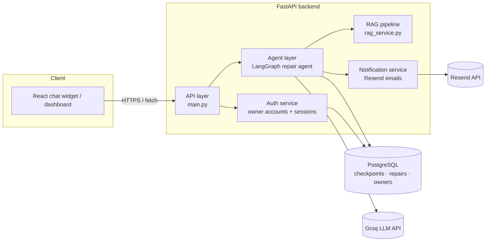
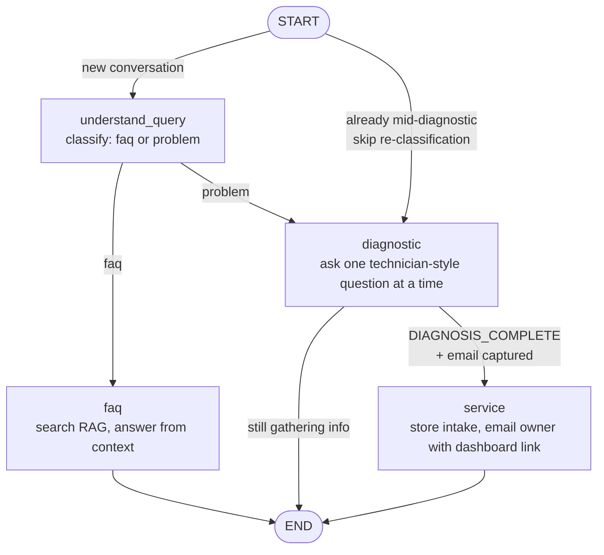

# MAARA — AI Customer Support & Repair Intake Agent

MAARA is a customer support chat agent for a computer/phone repair shop. It answers
general questions from a RAG knowledge base, runs a technician-style intake
conversation for repair requests, and hands the confirmed appointment off to the
shop owner through a login-protected scheduling dashboard.

## Tech stack

| Layer | Technology |
|---|---|
| Frontend | React 19 + TypeScript, Vite |
| Backend API | FastAPI (Python), Uvicorn |
| Agent orchestration | LangGraph (`StateGraph`) |
| LLM | Groq (`openai/gpt-oss-120b` via `langchain-groq`) |
| RAG / knowledge base | FAISS + `sentence-transformers` (`all-MiniLM-L6-v2`) |
| Persistence | PostgreSQL (conversation checkpoints, repair intake, owner accounts) |
| Transactional email | Resend |

## Architecture overview



The frontend never talks to Groq, Postgres, or Resend directly — everything goes
through the FastAPI backend, which is the only service holding secrets.

## API layer

All endpoints live in `backend/main.py`.

| Method | Path | Auth | Purpose |
|---|---|---|---|
| GET | `/api/health` | — | Liveness check |
| POST | `/api/repair` | — | Send a chat message, get the agent's reply (FAQ answer or next diagnostic question) |
| GET | `/api/auth/needs-setup` | — | Whether an owner account exists yet (drives login vs. signup UI) |
| POST | `/api/auth/signup` | Open only until the first owner exists, then requires a valid session | Create an owner/staff account |
| POST | `/api/auth/login` | — | Exchange email/password for a session token |
| GET | `/api/repair/pending` | Owner session (`Authorization: Bearer <token>`) | List unscheduled repair intakes |
| POST | `/api/repair/schedule/{token}` | Owner session | Schedule a repair (date/time, technician, notes) — triggers the customer's confirmation email |

## Agents layer (LangGraph)

The repair conversation is a `StateGraph` in `backend/services/agents/repair_agents.py`.
Each `/api/repair` call re-invokes the graph for the thread's `thread_id`; the
Postgres checkpointer restores where that conversation left off.



Notes on why it's built this way:

- **`START` has a conditional edge, not a fixed one.** Every turn re-enters at
  `START`; if it always went to `understand_query`, a bare follow-up reply (an
  address, "yes", a device model) would get freshly reclassified with no
  conversation context and could be misrouted to `faq`. The graph checks whether
  the thread is already mid-diagnostic and skips straight to `diagnostic` when it is.
- **The diagnostic node won't finish without an email.** It regex-extracts an
  email address from the human messages; if `DIAGNOSIS_COMPLETE` comes back
  without one on file, it asks for the email instead of finishing.
- **`service` never talks to the customer directly.** It stores the intake and
  emails the *owner* a link into the dashboard. The customer only hears back once
  the owner actually schedules the repair — see the Memory layer below.

## RAG pipeline

Full pipeline details: [`docs/rag-pipeline.md`](docs/rag-pipeline.md).

Summary: `backend/rag/excel_vector_rag.py` ingests `etech_chatbot_dataset.csv`,
embeds each row with `all-MiniLM-L6-v2`, and stores the vectors in a FAISS
`IndexFlatIP` index (`etech_faiss.index` + `etech_metadata.json`). At query time,
`backend/services/rag_service.py` embeds the customer's question, searches FAISS
for the top-k matches, and the `faq` node asks Groq to answer *only* from that
retrieved context — it's told explicitly to say "I'm not sure" rather than invent
prices, policies, or warranty details.

## Memory / persistence layer

Everything lives in one Postgres database (`DATABASE_URL`), split into three
independent concerns:

| Store | Owner | Purpose |
|---|---|---|
| LangGraph checkpoints (auto-managed tables) | `PostgresSaver` in `repair_agents.py` | Per-`thread_id` conversation state — messages, whether it's a problem report, diagnosis progress. This is what lets a customer's chat resume across API calls. |
| `repair_confirmations` | `services/confirmation_store.py` | One row per repair intake: summary, customer email, confirmation token, and (once scheduled) date/time, technician, and notes. |
| `owners`, `owner_sessions` | `services/auth_service.py` | Dashboard accounts (PBKDF2-hashed passwords) and bearer session tokens (7-day expiry). |

Tables are created automatically on backend startup (`init_table()` /
`init_tables()` calls) — no manual migration step is needed.

## Local development

Backend:

```bash
cd backend
pip install -r requirements.txt
cp .env.example .env   # fill in GROQ_API_KEY, DATABASE_URL, RESEND_*, FRONTEND_BASE_URL
python main.py          # http://localhost:8000
```

Frontend:

```bash
cd frontend/vite-project
npm install
cp .env.example .env    # VITE_API_BASE_URL=http://localhost:8000
npm run dev              # http://localhost:5173
```

The RAG index (`backend/rag/etech_faiss.index` + `etech_metadata.json`) must be
built once before the FAQ path works — see `docs/rag-pipeline.md`.

## Deployment

### Backend — Render

1. New Web Service, connect this repo, **Root Directory: `backend`**.
2. Build command: `pip install -r requirements.txt`
3. Start command: `uvicorn main:app --host 0.0.0.0 --port $PORT`
   (the `if __name__ == "__main__"` block in `main.py` is dev-only — it hardcodes
   `reload=True` and a fixed port, which Render doesn't use)
4. Add a managed Postgres instance; copy its connection string into `DATABASE_URL`.
5. Environment variables: `GROQ_API_KEY`, `DATABASE_URL`, `RESEND_API_KEY`,
   `RESEND_FROM_EMAIL`, `RESEND_OWNER_EMAIL`, `FRONTEND_BASE_URL` (set this to
   your Vercel URL once you have it, e.g. `https://maara.vercel.app`).

### Frontend — Vercel

1. New Project, connect this repo, **Root Directory: `frontend/vite-project`**.
2. Build command: `npm run build` · Output directory: `dist` (Vercel autodetects Vite).
3. Environment variable: `VITE_API_BASE_URL` = your Render backend URL
   (e.g. `https://maara-backend.onrender.com`).

### After both are deployed

Update `FRONTEND_BASE_URL` on Render to the real Vercel URL (and redeploy) so the
owner-alert email's dashboard link points at production, not `localhost:5173`.

## Known limitations

- **Resend sandbox mode.** Until a sending domain is verified at
  resend.com/domains, Resend will only deliver to the email address the Resend
  account was signed up with — not to arbitrary real customers. This is a Resend
  account setting, not a code issue.
- **LLM classification is occasionally imperfect.** The `understand_query`
  classifier can misjudge an ambiguous one-line message. The `route_from_start`
  short-circuit (see Agents layer above) prevents this from derailing an
  in-progress diagnostic conversation, but a genuinely ambiguous *first* message
  can still be misclassified.
